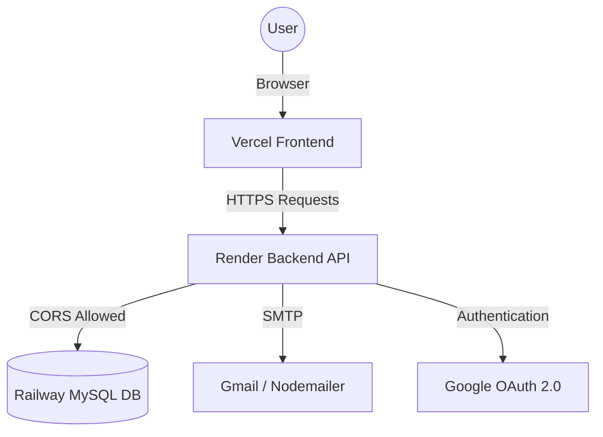

# 🎓 CHARUSAT eNOC Portal
### *A Smart, Secure, and Automated Internship NOC Management Ecosystem*

[](https://enoc-portal.onrender.com)
[](https://github.com/KrishExe07/Enoc-Portal)
[](https://github.com/KrishExe07/Enoc-Portal)

---

## 🌟 Vision
The **CHARUSAT eNOC Portal** is a high-performance web application designed to digitize and automate the internship **No Objection Certificate (NOC)** workflow. It eliminates manual paperwork, ensuring a seamless, transparent, and secure experience for Students, Faculty, and Administrators.

> [!TIP]
> **Live Links:**
> *   **Production URL:** [https://enoc-portal.vercel.app](https://enoc-portal.vercel.app)
> *   **API Endpoint:** [https://enoc-portal.onrender.com/api](https://enoc-portal.onrender.com/api)

---

## ⚡ Key Features

| Feature | Description |
| :--- | :--- |
| 🔐 **Google OAuth 2.0** | Secure, domain-restricted login for Students (`@charusat.edu.in`) and Faculty (`@charusat.ac.in`). |
| 📝 **NOC Workflow** | Automated submission, review, approval, and rejection queue for internship requests. |
| ✍️ **Digital Signatures** | Faculty and Admins can securely upload and manage electronic signatures for certificates. |
| 📧 **Instant Alerts** | Real-time email notifications for students and companies via Nodemailer (SMTP). |
| 📊 **Admin Controls** | Master dashboard for user management, company imports (Excel-based), and audit logs. |
| 📄 **PDF Generation** | Instant generation of signed, university-branded NOC documents. |
| 📱 **Responsive UI** | Premium, desktop-grade dashboard design optimized for performance. |

---

## 🏗️ Technical Architecture



### 🛠️ The Power Stack
*   **Frontend**: Vanilla HTML5, CSS3 (Modern Flexbox), JavaScript (ES13+)
*   **Backend**: Node.js, Express.js (RESTful API)
*   **Database**: MySQL with **Sequelize ORM** (Model-driven architecture)
*   **Security**: JWT, Helmet.js, express-rate-limit, Bcrypt
*   **Cloud Ecosystem**: 
    *   **Vercel**: Ultra-fast frontend hosting
    *   **Render**: Managed Node.js backend
    *   **Railway**: Global MySQL database proxy

---

## 🚀 Quick Start & Installation

### 1. 📥 Clone & Install
```bash
git clone https://github.com/KrishExe07/Enoc-Portal.git
cd Enoc-Portal
npm run install-all
```

### 2. ⚙️ Configure Environment
Create a `.env` in the `backend/` directory using the provided example:
```bash
cp backend/.env.example backend/.env
```
Ensure you fill in your **Railway DB Credentials**, **Google OAuth Client ID**, and **Gmail App Password**.

### 3. 🏁 Run Development Server
```bash
npm start
```
*Frontend: `http://localhost:8080` | Backend: `http://localhost:5000`*

---

## 📋 Professional NOC Workflow

1.  **Submission**: Student submits details + company info via their dashboard.
2.  **Faculty Review**: Assigned faculty reviews the data and adds approval comments.
3.  **Signature**: System automatically appends the faculty's digital signature.
4.  **Delivery**: Signed NOC is converted to PDF and emailed to both the **Student** and the **Company HR**.

---

## 📂 Project Organization

```text
📁 client/         # Frontend Design System & JS Modules
📁 backend/        # REST API, Sequelize Models & Routes
📁 data/           # Reference CSV/Excel for company imports
📁 docs/           # Comprehensive Implementation & Setup Guides
📁 scripts/        # Windows Utility & Automation Scripts
```

---

## 🛡️ Security First
*   **Domain Shield**: Only official `@charusat` emails are allowed to enter the ecosystem.
*   **SSL Proxy**: Database connections are encrypted using Railway's secure proxy.
*   **Tokenized Sessions**: Stateless JWT authentication ensures maximum security 24/7.
*   **Encryption**: All passwords and sensitive data are hashed using industry-standard Bcrypt.

---

## 🤝 Contribution & Feedback
Developed for **CHARUSAT University** to enhance process efficiency. 

> [!NOTE]
> For any technical queries or feature requests, please reach out to the project administrator via the [Contact Page](https://enoc-portal.vercel.app/contact.html).

---
**© 2026 CHARUSAT eNOC Portal • Version 2.0.0 • Developed with ❤️ for Education.**
